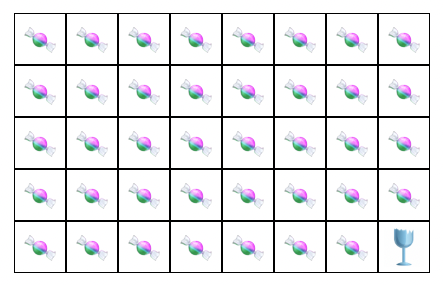

# Chomping Glass

An on-chain game of skill.



## On-chain program

This is a fork from: https://github.com/jarry-xiao/chomping-glass

The program is *immutably* deployed to Solana mainnet at the following address:
```
6zJv37uWY5xnENKDsdss6jMLE3ixMCjSdtHUu7fMRddF
```

To verify the program's code, use the following command (requires `solana-verify` which can be installed via `cargo install solana-verify`):
```
solana-verify verify-from-repo -um --program-id 6zJv37uWY5xnENKDsdss6jMLE3ixMCjSdtHUu7fMRddF hsttps://github.com/Ariiellus/EclipseFDNProject
```